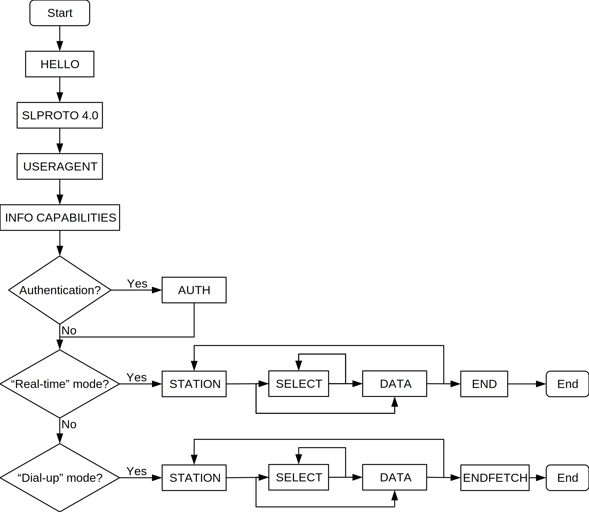

.. SeedLink documentation master file

.. _protocol:

Protocol
========

Abstract
--------
The SeedLink protocol is an application-level protocol for transferring time-series data of seismological and environmental applications in near-real time. A time series is represented as a sequence of variable length packets and is identified by a station and stream ID.

SeedLink communication takes place over TCP/IP connections. The default port is TCP 18000 in case of unencrypted connection and 18500 when using TLS. Several time series can be multiplexed in a single connection.

The current document specifies version 4 of the SeedLink protocol. Earlier version numbers refer to software implementation. There is no formal specification of earlier versions of the SeedLink protocol.

Requirements
------------
The key words "MUST", "MUST NOT", "REQUIRED", "SHALL", "SHALL NOT", "SHOULD", "SHOULD NOT", "RECOMMENDED", "MAY", and "OPTIONAL" in this document are to be interpreted as described in `RFC 2119 <https://datatracker.ietf.org/doc/html/rfc2119>`_ and `RFC 8174 <https://datatracker.ietf.org/doc/html/rfc8174>`_.

Overall Operation
-----------------
A SeedLink session starts with opening a TCP/IP connection and ends with closing the connection. The state of each session is independent of other sessions.

A session has two phases:

* Handshaking
* Data transfer

In handshaking phase, the client sends commands to the server and receives a response to those commands. In data transfer phase, the client receives a stream of SeedLink packets. In data transfer phase, the server MUST NOT accept any commands from the client except INFO and BYE.

Authentication
--------------
Users MAY be authenticated using their IP address or AUTH command. Access to some stations MAY be restricted to selected users. If a user does not have access to a station, then all commands SHOULD behave as if the station does not exist.

Data formats
------------
The payload of a SeedLink packet is usually a miniSEED record, but other formats are possible, as long as they include time and stream identification and are supported by the server and client. Format of the payload is determined by a format code and subformat code in packet header. Some codes are reserved for frequently used formats, rest can be dynamically assigned. The list of data formats supported by the server can be requested with "INFO FORMATS".

The payload of an INFO packet, which is sent in response to INFO command, is in JavaScript Object Notation (JSON) [`RFC7159 <https://datatracker.ietf.org/doc/html/rfc7159>`_] format.

Station ID and stream ID
------------------------
Each packet has a station ID and stream ID. Station ID is included in the SeedLink header while stream ID is derived from payload programmatically. In case of miniSEED 2.x and miniSEED 3.x (with FDSN source identifier), station ID is expected to be in form of NET_STA, where NET is network code and STA is station code, and stream ID is expected be in form of LOC_B_S_SS, where LOC is location code, B is band code, S is source code and SS is subsource code.

Pattern matching
----------------
STATION, SELECT and INFO commands match against station ID, stream ID and combined data format and subformat code. Supported metacharacters are "\*" (matching any number of characters) and "?" (matching a single character). In case of station and stream ID, the pattern is achored to the beginning and end of string. For example "\_\*Z" matches "_B_H_Z", but not "00_B_H_Z" or "_B_Z_H".

In case of combined format and subformat code, the pattern is anchored to the beginning of string only. For example "2" matches "2D", but does not match "D2".

Start and end time of packets
------------------------------
Each packet has a start time and an end time for its data. If a packet contains N samples, the start time is the time of the first sample and the end time is the time of the (N+1)th sample, e.g., the expected time of the first sample of the *next* packet in the same time series.

Sequence numbers
----------------
Each SeedLink packet has a 64-bit sequence number that identifies the position of the packet within the data stream of a station. Sequence numbers of a single station within a single server MUST be unique and strictly increasing and SHOULD be consecutive--during the data transfer phase, each packet received by a client MUST have greater sequence number than the previous packet of the same station. By capturing the current sequence number of each requested station, a client can resume data transfer in a different session without data loss when using the same server.

From a client's perspective, a gap in sequence numbers does not imply missing packets.

The current specification has no opinion about whether sequence numbers retain meaning across separate servers.

Handshaking
-----------
When the TCP/IP connection has been established, the server MUST NOT send any data to client before receiving a command from the client. If the first command is a HTTP verb, the server MAY switch to HTTP protocol (see :ref:`websocket`).

SeedLink commands consist of an ASCII string followed by zero or more arguments separated by spaces and terminated with carriage return (<cr>, ASCII code 13) followed by linefeed (<lf>, ASCII code 10).

The server MUST also accept a single <cr> or <lf> as a command terminator. Empty command lines MUST be ignored.

All commands, except HELLO, INFO, GETCAPABILITIES, and END, respond with ``OK<cr><lf>`` if accepted by the server. If the command was not accepted, then the server MUST respond with ``ERROR`` followed by error code (:ref:`error-codes`) and optionally error description on a single line, space separated. The response MUST be terminated by ``<cr><lf>``.

In order to speed up handshaking, especially over high-latency links, the client MAY send next command before receiving response to previous one (asynchronous handshaking).

Flowchart and an example are shown below.

Handshaking flowchart
^^^^^^^^^^^^^^^^^^^^^

Example handshaking
^^^^^^^^^^^^^^^^^^^

``>`` denotes data sent from client to server, ``<`` denotes data sent from server to client. Each line ends with <cr><lf>, which is not shown for better readability.

::

    > HELLO
    < SeedLink v4.0 (MySeedLink v1.0) :: SLPROTO:4.0
    < GEOFON
    > SLPROTO 4.0
    < OK
    > USERAGENT slinktool/4.3 libslink/2020.046
    < OK
    > GETCAPABILITIES
    < SLPROTO:4.0 TIME
    > ACCEPT 2 3
    < OK
    > STATION GE_APE
    < OK
    > SELECT
    < ERROR ARGUMENTS empty SELECT is not allowed in v4
    > SELECT *_B_H_?.2D
    < OK
    > DATA 1405339897
    < OK
    > STATION GE_WLF
    < OK
    > SELECT *_H_H_?:native
    < OK
    > DATA 254483417
    < OK
    > STATION GE_*
    < OK
    > SELECT *_H_H_?
    < OK
    > DATA 3929540
    < ERROR ARGUMENTS using sequence number with station wildcard is not supported
    > DATA
    < OK
    > END

Data Transfer
-------------

When handshaking has been finished with ``END``, the server starts sending data packets, which have the following structure:

===== ==================== ====== ======== ====== ==============================================
Field Field name           Type   Length   Offset Content
===== ==================== ====== ======== ====== ==============================================
1     Signature            CHAR   2        0      ASCII, "SE"
2     Data format          CHAR   1        2      ASCII
3     Subformat            CHAR   1        3      ASCII
4     Length of payload    UINT32 4        4      unsigned 4-byte integer, binary, little endian
5     Sequence number      UINT64 8        8      unsigned 8-byte integer, binary, little endian
6     Length of station ID UINT8  1        9      unsigned 1-byte integer, binary
7     Station ID           CHAR   variable 10     ASCII
8     Payload              binary variable 18     binary data
===== ==================== ====== ======== ====== ==============================================

Data format and subformat codes MUST be single ASCII characters in the range of '0'..'9' or 'A'..'Z'. The following codes are reserved:

+-----------------------------------+------------------------------+
| Format                            | Subformat                    |
+-------+---------------------------+-----------+------------------+
| Code  | Description               | Code      | Description      |
+=======+===========================+===========+==================+
|  2    | miniSEED 2.x              | D         | data/generic     |
|       |                           +-----------+------------------+
|       |                           | E         | event detection  |
|       |                           +-----------+------------------+
|       |                           | C         | calibration      |
|       |                           +-----------+------------------+
|       |                           | T         | timing exception |
|       |                           +-----------+------------------+
|       |                           | L         | log              |
|       |                           +-----------+------------------+
|       |                           | O         | opaque           |
+-------+---------------------------+-----------+------------------+
|  3    | miniSEED 3.x with FDSN    | D         | data/generic     |
|       | source identifier         |           |                  |
+-------+---------------------------+-----------+------------------+
| 4..9  | Reserved for FDSN formats |                              |
+-------+---------------------------+-----------+------------------+
| J     | JSON                      | I         | SeedLink info    |
|       |                           +-----------+------------------+
|       |                           | E         | SeedLink error   |
+-------+---------------------------+-----------+------------------+
| X     | XML                       |                              |
+-------+---------------------------+------------------------------+

Remaining codes can be assigned dynamically. A client SHOULD look up MIME type with INFO (e.g., "INFO FORMATS") before using format codes. "INFO STREAMS" shows the available formats.

In "dial-up mode" (FETCH command), only queued data is transferred. When transferring packets of all requested stations has completed, the server MUST append ASCII string ``END`` (without <cr><lf>) to the last packet and wait for the client to close connection. It is not allowed to send more data from server to client after END has been sent. Any commands except BYE MUST be ignored by the server. If the client does not close connection during reasonable time period after receiving END, then the connection MAY be closed by the server. 

In "real-time mode" (DATA command), the data transfer phase never ends unless the client aborts the connection or a network error occurs.

.. _seedlink-commands:

Commands
--------

All of the following commands are mandatory in version 4, except when marked with {CAP:*}. In the latter case, the command is supported if the server implements indicated capability.

Where a command allows or requires additional arguments, there MUST be simple white space between the command and its argument or arguments. Simple whitespace is one or more space (ASCII code 32) or horizontal tab (ASCII code 9) characters.

HTTP verbs OPTIONS, GET, HEAD, POST, PUT, DELETE, TRACE, and CONNECT are reserved.

All commands are case-insensitive. Maximum length of the command line is 256(?) characters, including the <cr><lf> terminator.

Square brackets denote optional parts. Ellipsis denotes a list of one or more items.

AUTH *type* *argument*... {CAP:AUTH}
    authenticates a user. Successful authentication un-hides restricted stations/streams that the user is authorized to access. Responds with "OK" if authentication was successful, "ERROR AUTH" (see :ref:`error-codes`) if authentication failed, "ERROR UNSUPPORTED" if command or *type* is not supported or "ERROR UNEXPECTED" if AUTH is supported, but connection is unencrypted. Authentication over unencrypted connection MUST NOT be allowed.
    
    Regardless if authentication is successful or not, access to non-restricted stations MUST be granted.
    
    If *type* is USERPASS, then arguments are *username* and *password*. Either must not contain spaces::
    
        > AUTH USERPASS johndoe letmein
        
    Type TOKEN is reserved, but not specified. Additional types may be added in future revisions of this specification.

BYE
    tells the server to close connection. Using this command is OPTIONAL.

DATA [*seq*]
    sets the starting sequence number of station(s) that match previous STATION command. *seq* is a decimal integer in ASCII coding. If *seq* is -1 or omitted, then transfer starts from the next available packet. If the sequence number is in the future or too distant past, then it MAY be considered invalid by the server and -1 MAY be used instead. If a packet with given sequence number is not available, then the sequence number of the next available packet MUST be used by the server. Transfer of packets continues in real-time when all queued data of the station(s) have been transferred ("real-time mode").

DATA *seq* *start_time* [*end_time*] {CAP:TIME}
    requests a time window from station(s) that match previous STATION command. Only packets that satisfy the following conditions are considered:

    #. packet.seq >= *seq* (if *seq* != -1)
    #. packet.start_time < *end_time* (if *end_time* given)
    #. packet.end_time > *start_time*

    The format of *start_time* and *end_time* is %Y-%m-%dT%H:%M:%S.%fZ, where %Y, %m, %d, %H, %M, %S denote year, month, day, hour, minute and second as in ANSI C  strftime() function and optional .%f denotes decimal fractions of second. Time zone MUST be Z (UTC). This format is compatible with ISO 8601.
    
    Using *seq*, it is possible to resume transfer of a time window in a new session.

END
    ends handshaking and switches to data transfer phase.

FETCH [*seq*]
    same as DATA [*seq*], except transfer of packets stops when all queued data of the station(s) have been transferred ("dial-up mode").

FETCH *seq* *start_time* [*end_time*] {CAP:TIME}
    same as DATA *seq* *start_time* [*end_time*], except transfer of packets stops when all queued data of the station(s) have been transferred ("dial-up mode").

GETCAPABILITIES
    returns space-separated server capabilities (:ref:`capabilities`) as a single line terminated by <cr><lf>.

HELLO
    responds with a two-line message (both lines terminated with <cr><lf>). For compatibility reasons, the first line MUST start with ``SeedLink vX.Y (implementation) :: ``, where X.Y is the highest supported protocol version and *implementation* is software implementation and version, such as "MySeedLink v1.0". For each supported major protocol version, ``SLPROTO:A.B`` MUST be added (space separated), where A is the major version and B is the highest minor version. Lower minor versions are expected to be implicitly supported. Legacy capabilities may be added.
    
    For example, here is a valid first line of HELLO response of a server that supoprt protocols 3.0, 3.1 and 4.0::
    
        > SeedLink v4.0 (2022.075 RingServer) :: SLPROTO:3.1 SLPROTO:4.0 CAP EXTREPLY NSWILDCARD BATCH WS:13
    
    The second line contains station or data center description specified in the configuration. Handshaking SHOULD start with HELLO.
    
INFO *item* [*station_pattern* [*stream_pattern*[.*format_subformat_pattern*]]]
    requests information about the server in JSON format. *item* can be one of the following: ID, FORMATS, STATIONS, STREAMS, CONNECTIONS. *station_pattern* matches the station ID, *stream_pattern* matches the stream ID, *format_subformat_pattern* matches the combined format and subformat code (2 caracters). Supported wildcards are "\*" and "?".
    
    The JSON schema is shown in Appendix B. INFO is allowed during both handshaking and data transfer phases. The response MUST be in form of one single packet with format code J. Subformat code MUST be I (successful request) or E (error). No ERROR response is allowed.
    
    The amount of info available depends on the server implementation and configuration. The server may also impose a limit on the maximum size of the JSON document. If the expected size of the document would exceed the limit, a JSON packet with error response would be sent.
    
    "INFO ID" is recommended for implementing keep-alive functionality.

SELECT [!]*stream_pattern*[.*format_subformat_pattern*][:*filter*]...
    selects given streams of a station. By default (if SELECT is omitted), all streams are requested.

    *stream_pattern* matches the stream ID, *format_subformat_pattern* matches the concatenated format and subformat code (2 caracters). Supported wildcards are "\*" and "?". In case of leading "!", the matching streams are excluded.
    
    *filter* can be used to convert data to different format and discard duplicate streams. Supported filters are listed with "INFO", for example:
    
    native
        provide data in native format (e.g., miniSEED 2.x) if available.
        
    3
        provide data in miniSEED 3.x if possible, converting the data on-the-fly if needed.
        
    The :*filter* suffix MUST NOT be used together with "!" prefix.

    SELECT can be used multiple times per station. A stream is selected if it matches any SELECT without "!" and does **not** match any SELECT with "!". If a stream matches multiple patterns with :*filter* suffix, the first match takes effect.

    The number of SELECT commands per station MAY be limited by the server to prevent excessive resource consumption.
    
    Available stream IDs can be requested with "INFO STREAMS". In case of miniSEED 2.x and miniSEED 3.x (with FDSN source identifier), the format of stream ID is LOC_B_S_SS, where LOC is location code, B is band code, S is source code and SS is subsource code.
    
    Example: select any streams with empty location code and band code B, but exclude subformat E::
    
        > SELECT _B* !*.*E
        
    Example: get any stream in miniSEED 3.x if possible, but opaque records in native format::
    
        > SELECT *.*O:native *:3
        
    An opaque stream, for example, "OCF.2O" matches both patterns, but according to the above rule, the first filter, "native", would take effect.

SLPROTO *version*
    Request protocol version. *version* is one of the supported SLPROTO versions reported by HELLO or a lower minor version thereof. For example, if HELLO reports SLPROTO:4.1 capability, both "SLPROTO 4.0" and "SLPROTO 4.1" would be valid. This command MUST be used once before any other commands except HELLO when using protocol version 4.0 or higher.

STATION *station_pattern*
    requests stations that match given pattern.

    *station_pattern* matches the station ID. Supported wildcards are "\*" and "?". Any following SELECT, DATA, or FETCH commands apply to all stations that match the given pattern, including stations that are added to the server in the future.
    
    Stations that already matched a previous STATION command are excluded.

    The number of station requests MAY be limited by the server to prevent excessive resource consumption.
    
    STATION may return ERROR for any implementation-defined reason. In this case, SELECT, DATA and FETCH commands up to next STATION must be ignored.
    
    Available station IDs can be requested with "INFO STATIONS". In case of miniSEED 2.x and miniSEED 3.x (with FDSN source identifier), the format of station ID is NET_STA, where NET is network code and STA is station code.
    
    Example:
        * request GE_WLF and select streams with band code B;
        * request stations whose station code ends with "F" (except GE_WLF) and select streams with either band code B or source code B;
        * request stations whose network code starts with "G" (except GE_WLF and stations whose station code ends with "F") and select streams whose band code, source code or subsource code starts with B:
    ::
    
        > STATION GE_WLF
        > SELECT *_B_*_*
        > STATION *F
        > SELECT *_B_*
        > STATION G*
        > SELECT *_B*
        
USERAGENT program_or_library/version...
    optionally identifies client software used. Argument is expected to be a space-separated list of ``program_or_library/version``. No spaces are allowed within individual items. For example when someone embeds slarchive into a larger framework, the USERAGENT can identify the wrapper system, slarchive and the library as::
    
        > USERAGENT wrapper/version slarchive/4.0 library/3.0.0
    
    The command has no effect on functionality, but helps with logging and statistics on the server side.

.. _error-codes:

Error codes
-----------
UNSUPPORTED
    command not recognized or not supported

UNEXPECTED
    command not expected

UNAUTHORIZED
    client is not authorized to use the command

LIMIT
    limit exceeded (e.g., too many STATION or SELECT commands were used)

ARGUMENTS
    incorrect arguments

AUTH
    authentication failed (invalid user, password or token were provided)

.. _capabilities:

Capabilities
------------
The current specification defines the following capabilities:

SLPROTO:#.#
    SeedLink protocol version.

AUTH\:*type*
    authentication *type* supported.

TIME
    time windows supported with DATA and FETCH.

.. _websocket:

Appendix A. WebSocket operation
-------------------------------
SeedLink can be used over WebSocket `RFC 6455 <https://tools.ietf.org/html/rfc6455>` if this is supported by the server.

Each command from client to server MUST be sent as a Unicode message consisting of 1 frame. Line terminator <cr><lf> is OPTIONAL.

Each command response from server to client MUST be sent as a Unicode message consisting of 1 frame. Each line MUST be terminated by <cr><lf>.

Each packet from server to client (including INFO packets) MUST be sent as a binary message consisting of 1 frame.

The final ``END`` (when "dial-up mode" is used) MUST be sent as a binary message.

Depending on the maximum frame size of a particular WebSocket implementation, the maximum size of SeedLink packet encapsulated in WebSocket frame may be smaller than 2^32+7 bytes, which is the theoretical maximum packet size supported by SeedLink.

Appendix B. JSON schema
-----------------------

::

    {
        "$schema": "http://json-schema.org/draft-07/schema#",
        "description": "SeedLink v4 INFO schema",
        "type": "object",
        "required": [
            "software",
            "organization"
        ],
        "properties": {
            "software": {
                "description": "Software ID as in HELLO response",
                "type": "string"
            },
            "organization": {
                "description": "Station or data center description as in HELLO response",
                "type": "string"
            },
            "error": {
                "type": "object",
                "required": [
                    "code",
                    "message"
                ],
                "properties": {
                    "code": {
                        "description": "Error code",
                        "type": "string"
                    },
                    "message": {
                        "description": "Error message",
                        "type": "string"
                    }
                }
            },
            "format": {
                "description": "Dictionary of formats supported by the server",
                "type": "object",
                "patternProperties": {
                    "^[A-Z0-9]$": {
                        "type": "object",
                        "required": [
                            "mimetype",
                            "subformat"
                        ],
                        "properties": {
                            "mimetype": {
                                "description": "MIME type of format",
                                "type": "string"
                            },
                            "subformat": {
                                "type": "object",
                                "minProperties": 1,
                                "patternProperties": {
                                    "^[A-Z0-9]$": {
                                        "description": "Description of subformat",
                                        "type": "string"
                                    }
                                }
                            }
                        }
                    }
                }
            },
            "filter": {
                "description": "Dictionary of filters supported by the server",
                "type": "object",
                "patternProperties": {
                    "^[A-Z0-9]$": {
                        "description": "Description of filter",
                        "type": "string"
                    }
                }
            },
            "station": {
                "type": "array",
                "items": {
                    "type": "object",
                    "required": [
                        "id",
                        "description",
                        "begin_seq",
                        "end_seq",
                        "backfill"
                    ],
                    "properties": {
                        "id": {
                            "description": "Station ID",
                            "type": "string"
                        },
                        "description": {
                            "description": "Station description",
                            "type": "string"
                        },
                        "begin_seq": {
                            "description": "First sequence number available",
                            "type": "integer"
                        },
                        "end_seq": {
                            "description": "Next sequence number (last sequence number available + 1)",
                            "type": "integer"
                        },
                        "backfill": {
                            "description": "How many seconds to wait for gaps to fill: -1 = undefined, 0 = data is strictly in time order",
                            "type": "integer"
                        },
                        "stream": {
                            "type": "array",
                            "items": {
                                "type": "object",
                                "required": [
                                    "id",
                                    "format",
                                    "subformat",
                                    "origin",
                                    "begin_time",
                                    "end_time"
                                ],
                                "properties": {
                                    "id": {
                                        "description": "Stream ID",
                                        "type": "string"
                                    },
                                    "format": {
                                        "description": "Stream format",
                                        "type": "string",
                                        "pattern": "^[A-Z0-9]$"
                                    },
                                    "subformat": {
                                        "description": "Stream subformat",
                                        "type": "string",
                                        "pattern": "^[A-Z0-9]$"
                                    },
                                    "origin": {
                                        "description": "Origin of stream",
                                        "type": "string",
                                        "enum": ["undefined", "native", "converted"],
                                    },
                                    "begin_time": {
                                        "description": "Start time of the first packet in the ringbuffer",
                                        "type": "string"
                                    },
                                    "end_time": {
                                        "description": "End time of the last packet in the ringbuffer",
                                        "type": "string"
                                    }
                                }
                            }
                        }
                    }
                }
            }
        }
    }

Appendix C. Differences between SeedLink 3 and SeedLink 4
---------------------------------------------------------
SeedLink 4 protocol is not compatible with SeedLink 3 clients. However, SeedLink 4 is enabled by using the "SLPROTO 4.0" command, which is not known to SeedLink 3 clients, so a SeedLink 4 server can also support SeedLink 3 protocol.

The following features were added or changed in SeedLink 4.

* New packet header, multiple payload formats and variable length packets are supported.
* Network and station code combined to station ID (no length restriction).
* Location and channel code combined to stream ID (no length restriction).
* Optional station ID and stream ID arguments of INFO, wildcards supported.
* STATION takes a single station ID argument and supports wildcards.
* Different SELECT syntax, wildcard "\*" supported.
* 64-bit sequence numbers.
* ISO8601-compatible date format of DATA and FETCH.
* Optional end-time and sequence number (-1) with DATA and FETCH.
* AUTH, GETCAPABILITIES, SLPROTO and USERAGENT commands added.
* INFO FORMATS.
* INFO format is JSON instead of XML.
* Extended ERROR response.
* Support for asynchronous handshaking.

The following commands present in some older versions of the SeedLink protocol were removed in SeedLink 4:

================= ===========================================================
Command           Reason of removal
================= ===========================================================
BATCH             similar functionality provided by asynchronous handshaking
CAPABILITIES      similar functionality provided by SLPROTO
CAT               same functionality provided by "INFO STATIONS"
INFO CAPABILITIES same functionality provided by GETCAPABILITIES
INFO GAPS         incompatible with unsorted data packets, performance issues
TIME              same functionality provided by extended DATA syntax
================= ===========================================================
